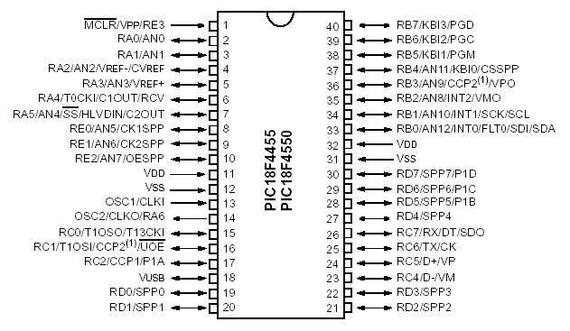
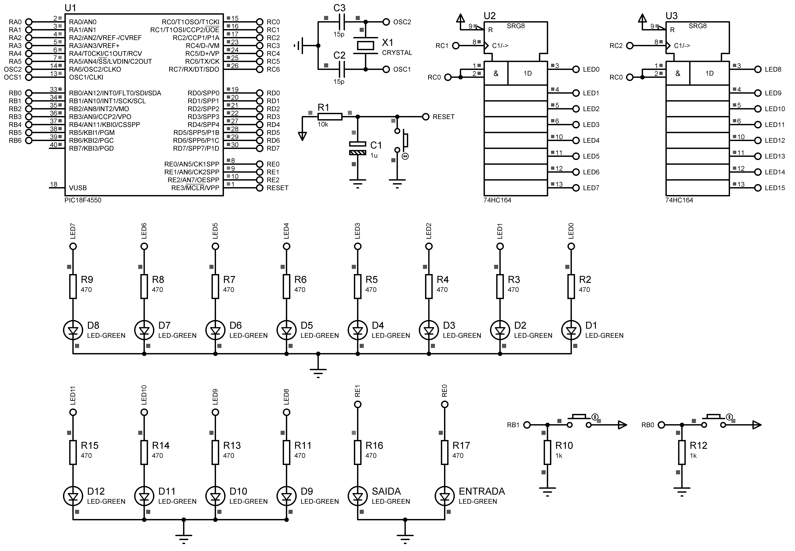
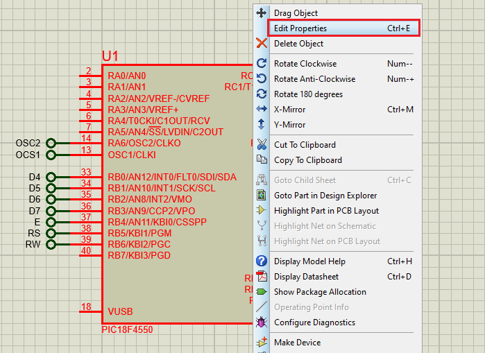

# Access Control

Firmware that simulates an access control system for a Viking Boat toy

## How it works

- The toy has an obstacle system, like a gate, at the entrance and at the exit (simulated with LEDs) to activate or deactivate the passage of people. In the beginning, the entrance and the exit are free, and in operation both are closed. When the toy stops the exit is opened, and the entrance will only be opened when all people leave the toy
- People enter the toy one by one, in a row, and a maximum of 8 people, and a display shows the number of people in the toy
- People are counted from 2 presence sensors, one positioned at the entrance and the other at the exit (simulated with 2 external interruptions, where the entrance is of high priority and rising edge; and the exit of low priority and falling edge)
- At the beginning both gates are open, so there may be people giving up and leaving the toy
- When reaching 8 people in the toy, an LED flashes to simulate the operation of the toy
- At the end there is the process of leaving people one by one, after this, release the entrance gate

## ☁️ Links

- [Specifications](docs/pdf/specifications.pdf)
- [Support Material](docs/pdf/advanced_specifications.pdf)

## 💻 Project

#### PICF184550



#### Hardware



#### Running Simulation


## 🚀 Technologies

 C ANSI

 Proteus

## 🏃 Usage

Before you compile the code you **have to install the [XC8 Compiler](http://www.microchip.com/mplabxc8windows)**, then just copy and paste one by one the commands bellow:

```
git clone https://github.com/douglasJovenil/access-control
cd access-control/src
xc8 -I../include -I../lib/74HC164 -I../lib/74HC164/74HC164.c main.c -Ofirmware --chip=18f4550 --outdir=../build
```

On software Proteus, open the [simulation file](hardware/hardware.pdsprj), right click on PICF18F4550 and click on **edit properties**



Click on folder icon


Navigate to the [build](build) folder and select the hex


Click on **OK** and then click on **play** to start the simulation


